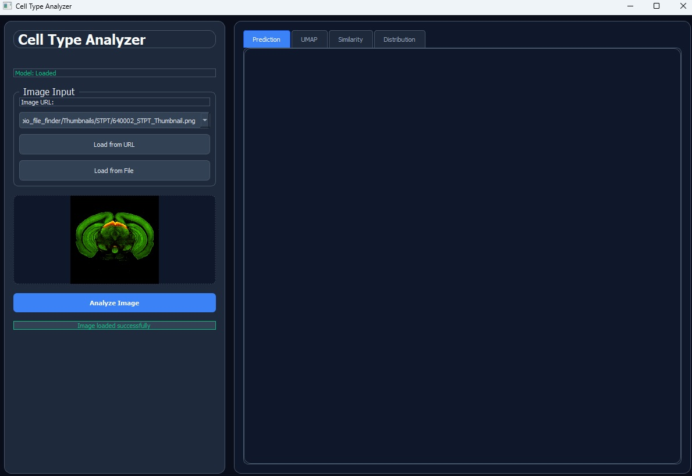
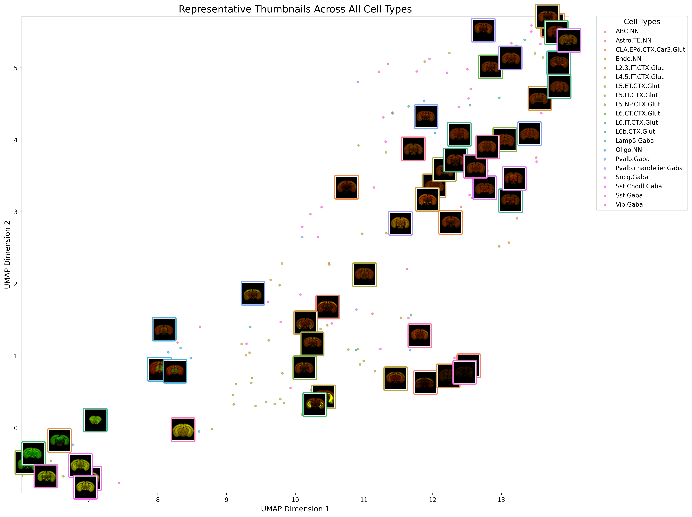

# Cell Type Inference from 2D Fluorescent Brain Images

A Python-based machine learning pipeline for direct cell type inference from 2D fluorescent brain images using Vision Transformer and spatial mapping.

<td width="100%" align="center">

</td>

---

## 📑 Table of Contents

- [Overview](#overview)
- [Key Features](#key-features)
- [Architecture](#architecture)
- [User Interface](#user-interface)
- [Pipeline Components](#pipeline-components)
- [Output Visualizations](#output-visualizations)
  - [Cell Type Distance Matrix](#1-cell-type-distance-matrix)
  - [UMAP Embeddings with Thumbnails](#2-umap-embeddings-with-thumbnails)
  - [Spatial Gradients](#3-spatial-gradients)
  - [Cell Type Distribution](#4-cell-type-distribution)
  - [Prediction Validation](#5-prediction-validation)
- [Mathematical Foundations of Cell Type Gradients](#mathematical_foundations_of_celltype_gradients)
- [Acknowledgments](#acknowledgments)
- [Citation](#citation)

---

## Overview

This toolset is a Python-based pipeline designed to directly infer cell types from 2D fluorescent brain images. It integrates multiple machine learning and data visualization techniques to map fluorescent images to their most likely spatial transcriptomic cell types. The images and associated cell type annotations used to develop this tool were provided by the Allen Institute through the MapMySections challenge.

[↑ Back to Table of Contents](#-table-of-contents)

---

## Key Features

<div align="center">
<table>
<tr>
<td width="33%" align="center">
<h3>🧠 Deep Learning</h3>
Vision Transformer (ViT) for advanced feature extraction from fluorescent brain images
</td>
<td width="33%" align="center">
<h3>📊 Data Analysis</h3>
UMAP, K-Means clustering, and Kernel Density Estimation for analysis
</td>
<td width="33%" align="center">
<h3>🎯 Prediction</h3>
Gradient Boosting Regressor for cell type distribution prediction
</td>
</tr>
</table>
</div>

The core functionality includes:
- Extracting and encoding features from 2D fluorescent images
- Predicting cell type distributions using supervised learning
- Visualizing results through plots and embeddings

[↑ Back to Table of Contents](#-table-of-contents)

---

## Architecture

The pipeline leverages a pre-trained Vision Transformer (ViT) for deep feature extraction from input images. These features are then processed using dimensionality reduction methods such as UMAP to reveal structure in the data. For clustering and density analysis, the tool uses K-Means, Convex Hulls, and Kernel Density Estimation (KDE). A Gradient Boosting Regressor is employed to predict the distribution of cell types in new images based on learned patterns from the training set.

[↑ Back to Table of Contents](#-table-of-contents)

---

## User Interface

The tool also provides a user interface for interaction:

<div align="center">
<table>
<tr>
<td width="33%" align="center">

<br><strong>Upload Interface</strong>
<br>Image upload functionality
</td>
<td width="33%" align="center">

<br><strong>Prediction Results</strong>
<br>Cell type predictions
</td>
<td width="33%" align="center">

<br><strong>Distribution Analysis</strong>
<br>cell type distribution visualization
</td>
</tr>
</table>
</div>

[↑ Back to Table of Contents](#-table-of-contents)

---

## Pipeline Components

<div align="center">

| Component | Technology | Purpose |
|-----------|------------|---------|
| **Feature Extraction** | Vision Transformer (ViT) | Extract deep features from fluorescent images |
| **Dimensionality Reduction** | UMAP | Reveal data structure and patterns |
| **Clustering** | K-Means, Convex Hulls | Group similar cell types |
| **Density Analysis** | Kernel Density Estimation | Analyze spatial distributions |
| **Prediction** | Gradient Boosting Regressor | Predict cell type distributions |

</div>

[↑ Back to Table of Contents](#-table-of-contents)

---

## Output Visualizations

The tool provides visualization outputs with detailed analysis capabilities:

### 1. Cell Type Distance Matrix

<div align="center">

</div>

**Description:** Pairwise distance matrix showing the UMAP-space relationships between cell types, with ABC.NN as the reference. This visualization represents the Euclidean distances between cell types in a UMAP-projected 2D space. Each value indicates how similar or dissimilar a given cell type is to the reference cell type (ABC.NN). The matrix helps identify functional or spatial relationships between cell types—clusters may share biological roles or anatomical locations.

[↑ Back to Table of Contents](#-table-of-contents)

### 2. UMAP Embeddings with Thumbnails

<div align="center">

</div>

**Description:** UMAP projection of cell type embeddings, overlaid with representative thumbnails for each population. This plot combines dimensionality reduction (UMAP) with sample thumbnails to contextualize cell type distributions. Thumbnails are small images that represent typical samples for each cell type. The plot provides visual validation of UMAP groupings—similar-looking samples should cluster together.

[↑ Back to Table of Contents](#-table-of-contents)

### 3. Spatial Gradients

<div align="center">

</div>

**Description:** Spatial gradient of cell type across UMAP dimensions, with neighboring cell types labeled. This plot highlights the distribution of specific cells relative to other populations. Proximity implies shared cortical layers or circuits. The gradient reveals spatial organization—this subtype may localize to specific cortical regions.

[↑ Back to Table of Contents](#-table-of-contents)

### 4. Cell Type Distribution

<div align="center">
<table>
<tr>
<td width="50%" align="center">

</td>
<td width="50%" align="center">

</td>
</tr>
</table>
</div>

**Description:** Predicted cell type distribution showing relative abundance across populations. This visualization represents the model-predicted proportions of different cell types in a given sample or region. The hierarchical structure groups related cell types. The distribution highlights cortical cell type composition, sorted from dominant components.

[↑ Back to Table of Contents](#-table-of-contents)

### 5. Prediction Validation

<div align="center">

</div>

**Description:** Comparison of predicted cell type proportions versus average counts from similar training samples. This bar chart contrasts model predictions (blue) with averages from similar training data (orange) to assess confidence and consistency. Close matches suggest reliable predictions. The plot validates predictions against training data, flagging potential outliers or low-confidence estimates.

[↑ Back to Table of Contents](#-table-of-contents)

---

### Mathematical Foundations of Cell Type Gradients

<div align="center">

</div>

[↑ Back to Table of Contents](#-table-of-contents)

---

## Acknowledgments

The images and associated cell type annotations used to develop this tool were provided by the **Allen Institute** through the [MapMySections challenge](https://alleninstitute.github.io/MapMySections/). The tool provides side-by-side comparisons of predicted vs. average cell type distributions in similar images based on this dataset.

[↑ Back to Table of Contents](#-table-of-contents)

---

## Citation
If you use this tool in your research, please cite:

```bibtex
@software{cell_type_inference_2d,
  title={Cell Type Inference from 2D Fluorescent Brain Images},
  author={Nooshin Bahador},
  year={2025},
  url={https://github.com/nbahador/cell_type_analyzer.git},
  note={Python-based pipeline for direct cell type inference from 2D fluorescent brain images using Vision Transformer and spatial mapping}
}
```

[↑ Back to Table of Contents](#-table-of-contents)

---
